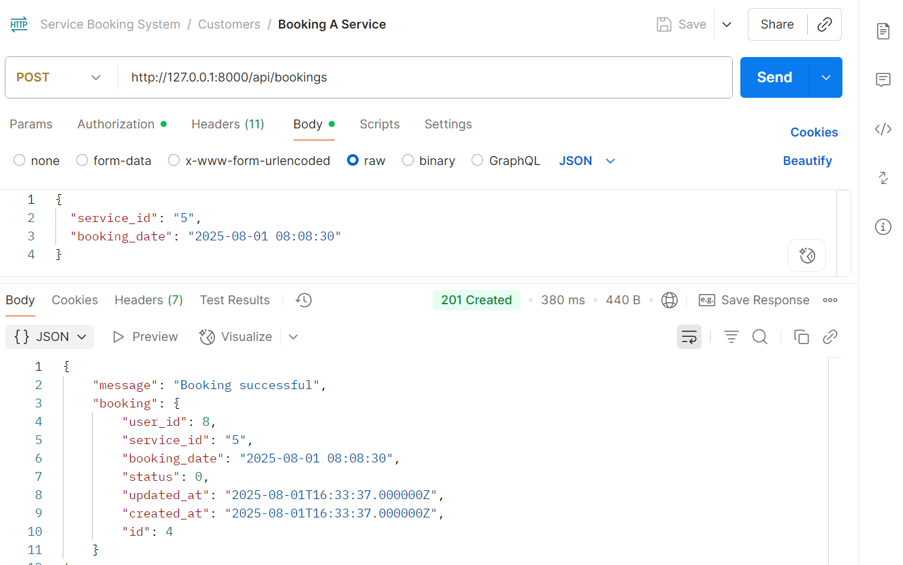

## 🔌 API Testing Instructions

### All code in the Main Branch

## Requirements
- PHP and Composer installed
- Laravel project set up and running locally (`php artisan serve`)
- Database configured in `.env`
- Database seeded with admin user and initial services
- Postman installed for API testing

## Setup Instructions

1. **Clone the repository:**

   ```bash
   git clone https://github.com/shafiqul-iislam/service_booking_system.git
   cd service_booking_system

### Install dependencies
- composer install
- npm install & npm run build

### Copy .env file and configure database
- cp .env.example .env

### Update your .env file with your database credentials
- DB_CONNECTION=mysql
- DB_HOST=127.0.0.1
- DB_PORT=3306
- DB_DATABASE=service_booking_system
- DB_USERNAME=your_username
- DB_PASSWORD=your_password

### Generate application key
- php artisan key:generate

### Run database migrations
- php artisan migrate

### Seed the database
- php artisan db:seed

### Seed the database
- Serve the application locally

### 🔐 Authentication
Use Sanctum token-based auth. On login:
- You’ll receive an `access_token`.
- Add this as a **Bearer Token** in Postman → Authorization tab.

---

## 📬 Endpoints Overview

### 🧑 Customer APIs
| Method | Endpoint              | Description              |
|--------|-----------------------|--------------------------|
| POST   | /api/register         | Register as customer     |
| POST   | /api/login            | Login as customer        |
| GET    | /api/services         | List all services        |
| POST   | /api/bookings         | Book a service           |
| GET    | /api/bookings         | View customer bookings   |

### 🛠️ Admin APIs
| Method | Endpoint              | Description              |
|--------|-----------------------|--------------------------|
| POST   | /api/admin/login      | Login as admin           |
| POST   | /api/services         | Create service (admin)   |
| PUT    | /api/services/{id}    | Update service (admin)   |

---

## 📦 Postman Collection

Download and import the provided Postman collection:
**`ServiceBookingAPI.postman_collection.json`**

It includes:
- Auth requests
- Example headers & bodies
- Response examples

---

## 🧪 Running Tests
php artisan test


## Screenshots

### Customer Registation


### Customer Login


### Customer Service List


### Customer Booking Service


### Customer Booking List


### Admin Login


### Admin Create Service


### Admin Update Service
